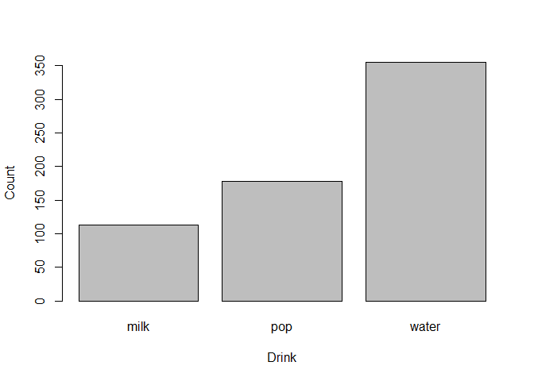
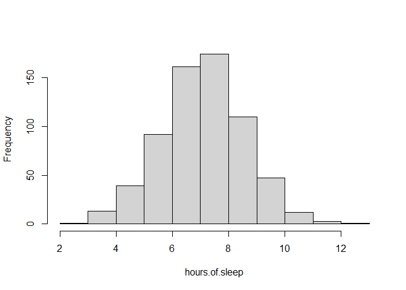
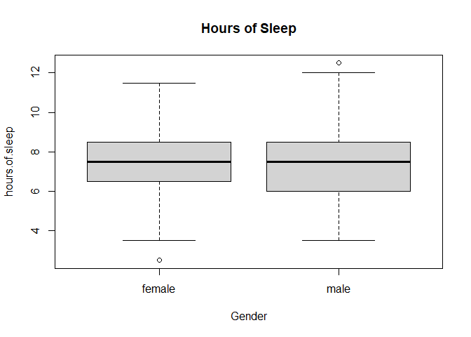
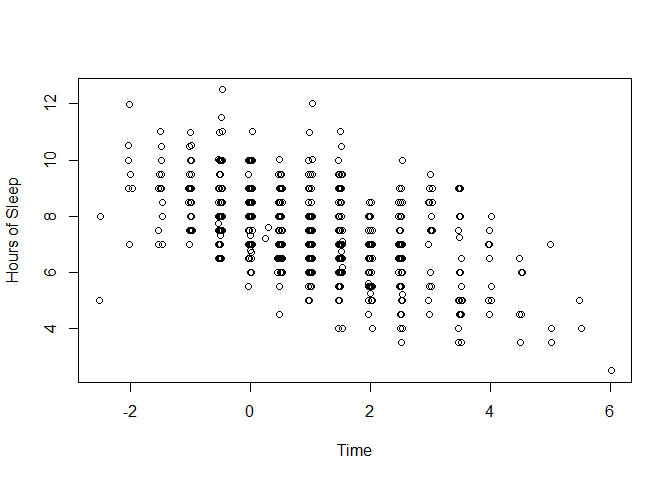
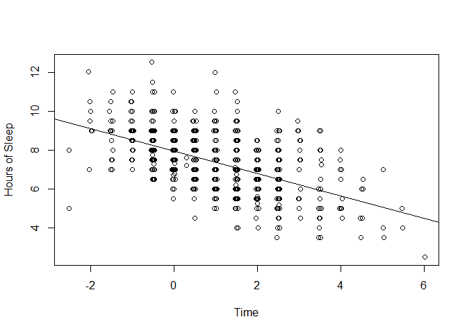
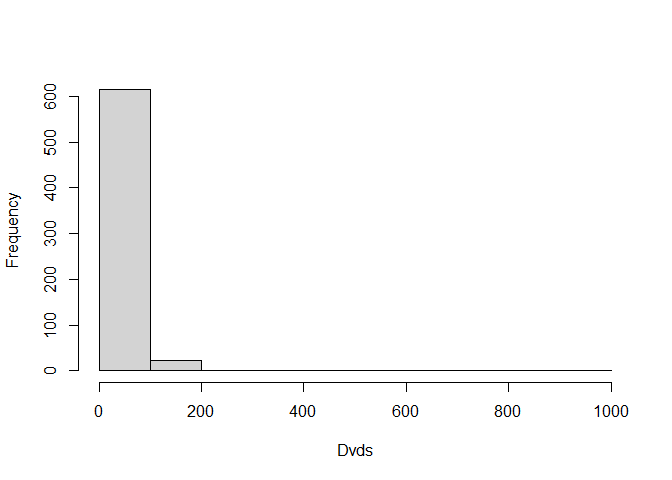
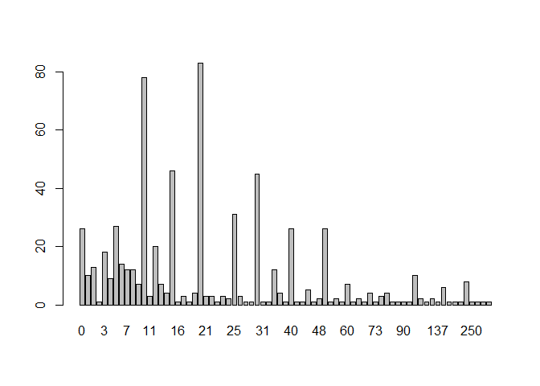
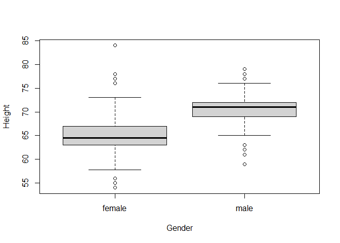
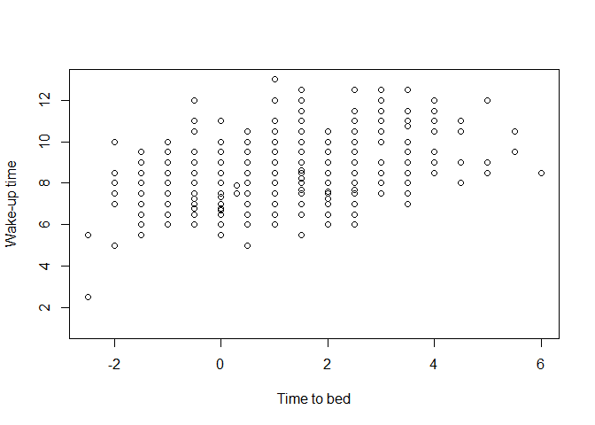
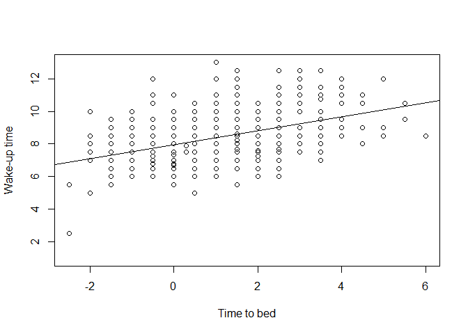

Chapter 1: An Introduction to R
================
2023-06-10

# 1.2 Exploring a Student Data set

## Reading the Data into R

The data for 657 students were recorded in a spreadsheet and saved as
the file “studentdata.txt” in text format with tabs between the fields.
The first line of the data file is a header that includes the variable
names.

``` r
library(LearnBayes)
data(studentdata)
# Display the first row of the data frame 
studentdata[1, ]
```

    ##   Student Height Gender Shoes Number Dvds ToSleep WakeUp Haircut Job Drink
    ## 1       1     67 female    10      5   10    -2.5    5.5      60  30 water

## R Commands to Summarize and graph a Single Batch

One categorical variable in this data set is `Drink` which indicates the
student’s drinking preference between milk, pop, and water.

``` r
# Make the variable names visible in the R environment
attach(studentdata)
# Tally the different responses 
table(Drink) 
```

    ## Drink
    ##  milk   pop water 
    ##   113   178   355

``` r
# Bar plot 
t = table(Drink) 
barplot(t, xlab='Drink', ylab='Count')
```

<!-- -->

Suppose we are next interested in examining how long the students slept
the previous night.

``` r
hours.of.sleep = WakeUp - ToSleep 
# Descriptive statistics
summary(hours.of.sleep)
```

    ##    Min. 1st Qu.  Median    Mean 3rd Qu.    Max.    NA's 
    ##   2.500   6.500   7.500   7.385   8.500  12.500       4

``` r
# Construct a histogram to see the distribution
hist(hours.of.sleep, main="")
```

<!-- -->

## R Commands to Compare Batches

Now we want to answer a question: “Do men tend to sleep longer than
women?”

``` r
# Constructing parallel box plots of sleeping times of man and women.
boxplot(hours.of.sleep ~ Gender)
title("Hours of Sleep")
```

<!-- -->

Suppose we wish to divide the haircut prices into two groups - the
haircut prices for the men and the haircut prices for the women. We do
this by use of the R logical operator `==`

``` r
female.Haircut = Haircut[Gender=='female'] 
male.Haircut = Haircut[Gender=='male'] 
# Summarize descriptive statistics 
summary(female.Haircut) 
```

    ##    Min. 1st Qu.  Median    Mean 3rd Qu.    Max.    NA's 
    ##    0.00   15.00   25.00   34.08   45.00  180.00      19

``` r
summary(male.Haircut) 
```

    ##    Min. 1st Qu.  Median    Mean 3rd Qu.    Max.    NA's 
    ##    0.00    0.00   12.00   10.54   15.00   75.00       1

## R Commands for Studying Relationships

To get a good night’s sleep, one may want to go to bed early in the
evening. This raises the question: “Is the length of sleep for a student
related to the time that he/she goes to be?” We can explore the
relationship between the `ToSleep` and `hours.of.sleep` variables by
means of a scatter plot.

``` r
# Construct a scatter plot 
plot(jitter(ToSleep), jitter(hours.of.sleep),
     xlab="Time", ylab="Hours of Sleep")
```

<!-- -->

We can describe the decreasing pattern in this scatter plot by fitting a
line.

``` r
fit = lm(hours.of.sleep ~ ToSleep)
# Display the least-squares line 
fit 
```

    ## 
    ## Call:
    ## lm(formula = hours.of.sleep ~ ToSleep)
    ## 
    ## Coefficients:
    ## (Intercept)      ToSleep  
    ##      7.9628      -0.5753

The slope is approximately -0.5, which means that a student loses about
a half-hour of sleep for every hour later that he/she goes to bed.

``` r
# Display the line on top of the scatter plot 
plot(jitter(ToSleep), jitter(hours.of.sleep),
     xlab="Time", ylab="Hours of Sleep")
abline(7.9628, -0.5753)
```

<!-- -->

# 1.3 Exploring the Robustness of the t Statistic

## Writing a Function to Compute the t Statistic

To begin, we generate random data for the samples of xs and ys. We
simulate a sample of 10 observations from a normal distribution with
mean 50 and standard deviation 10 using the `rnorm` function.

``` r
x = rnorm(10, mean=50, sd=10) 
y = rnorm(10, mean=50, sd=10)

# Sample size 
m = length(x) 
n = length(y) 

# Compute the pooled standard deviation 
sp = sqrt((m-1)*sd(x)^2+(n-1)*sd(y^2)/(m+n-2))

# Compute the t statistic 
t = (mean(x)-mean(y))/(sp*sqrt(1/m+1/n)) 
print(t)
```

    ## [1] -0.1714608

``` r
# Write a short R function to compute t statistic. 
tstatistic = function(x, y)
{
    m = length(x)
    n = length(y) 
    sp = sqrt(((m-1)*sd(x)^2+(n-1)*sd(y)^2) / (m+n-2))
    t = (mean(x)-mean(y)) / (sp*sqrt(1/m + 1/n))
    return(t) 
}

# Save the function as "tstatistic.R"
# Load the function 
# source("tstatistic.R")

data.x = c(1, 4, 3, 6, 5) 
data.y = c(5, 4, 7, 6, 10)
tstatistic(data.x, data.y)
```

    ## [1] -1.937926

## Programming a Monte Carlo Simulation

The following is an R script that implements the simulation algorithm
for normal populations with mean 0 and standard deviation 1. The R
variable `alpha` is the stated significance level, `m` and `n` are the
sample sizes, and `N` is the number of simulations. The `rnorm` command
is used to simulate the two samples and `t` contains the value of the t
statistic. One decides to reject if $$abs(t)>qt(1 - alpha/2, n+m-2)$$
where $qt(p, df)$ is the *p*th quantile of a t distribution with *df*
degrees of freedom.

``` r
alpha=.1; m=10; n=10    # set alpha, m, n
N = 10000               # set the number of simulations 
n.reject = 0            # counter of num. of rejections 

for (i in 1:N) 
{
    x = rnorm(m, mean=0, sd=1)    # simulate xs from population 1 
    y = rnorm(n, mean=0, sd=1)    # simulate ys from population 2 
    t = tstatistic(x, y)
    
    if (abs(t)>qt(1-alpha/2, n+m-2))
        n.reject = n.reject + 1   # reject if |t| exceeds critical pt 
}
true.sig.level = n.reject/N       # est. is proportion of rejections 
```

# Exercises

## 1. Movie DVDs owned by students

The variable `Dvds` in the student data set contains the number of movie
DVDs owned by students in the class. \### (a) Construct a histogram of
this variable

``` r
hist(Dvds, main="")
```

<!-- -->

### (b) Summarize this variable

``` r
summary(Dvds)
```

    ##    Min. 1st Qu.  Median    Mean 3rd Qu.    Max.    NA's 
    ##    0.00   10.00   20.00   30.93   30.00 1000.00      16

### (c) Construct a frequency table of the individual values of `Dvds` that were observed.

``` r
students.dvds = table(Dvds)
barplot(students.dvds) 
```

<!-- -->

## 2. Student heights

The variable `Height` contains the height (in inches) of each student in
the class. \### (a) Construct parallel box plots of the heights by the
`Gender` variable.

``` r
boxplot(Height ~ Gender)
```

<!-- -->

### (b) Assign the box plot output to a variable and print the output.

``` r
output = boxplot(Height ~ Gender) 
```

<!-- -->

``` r
print(output) 
```

    ## $stats
    ##       [,1] [,2]
    ## [1,] 57.75   65
    ## [2,] 63.00   69
    ## [3,] 64.50   71
    ## [4,] 67.00   72
    ## [5,] 73.00   76
    ## 
    ## $n
    ## [1] 428 219
    ## 
    ## $conf
    ##          [,1]    [,2]
    ## [1,] 64.19451 70.6797
    ## [2,] 64.80549 71.3203
    ## 
    ## $out
    ##  [1] 56 76 55 56 76 54 54 84 78 77 56 63 77 79 62 62 61 79 59 61 78 62
    ## 
    ## $group
    ##  [1] 1 1 1 1 1 1 1 1 1 1 1 2 2 2 2 2 2 2 2 2 2 2
    ## 
    ## $names
    ## [1] "female" "male"

### (c) Based on the box plots, on average, male students are approximately 5 inches taller than female students.

## 3. Sleeping times

The variables `ToSleep` and `WakeUp` contain, respectively, the time to
bed and wake-up time for each student the previous evening. (The data
are recorded as hours past midnight, so a value of -2 indicates 10 P.M)
\### (a) Construct a scatter plot of `ToSleep` and `WakeUp`.

``` r
plot(ToSleep, WakeUp, 
     xlab="Time to bed", ylab="Wake-up time")
```

<!-- -->

### (b) Find a least-squares fit to these data.

``` r
fit = lm(WakeUp ~ ToSleep)
fit 
```

    ## 
    ## Call:
    ## lm(formula = WakeUp ~ ToSleep)
    ## 
    ## Coefficients:
    ## (Intercept)      ToSleep  
    ##      7.9628       0.4247

### (c) Place the least-squares fit on the scatter plot

``` r
# In R markdown, we need to re-run the plot command 
plot(ToSleep, WakeUp, 
     xlab="Time to bed", ylab="Wake-up time")
abline(7.9628, 0.4247)
```

<!-- -->

### (d) The wake-up time for a student who went to bed at midnight can be estimated as: $$\Large 0.4247\times0+7.9628 = 7.9628 \approx 8 A.M$$
