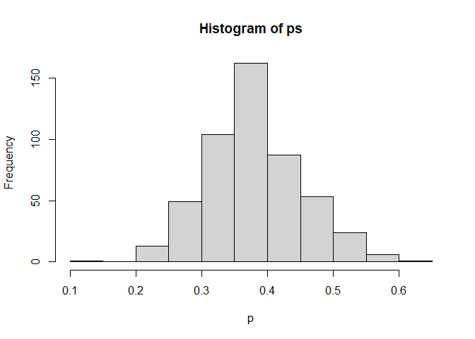
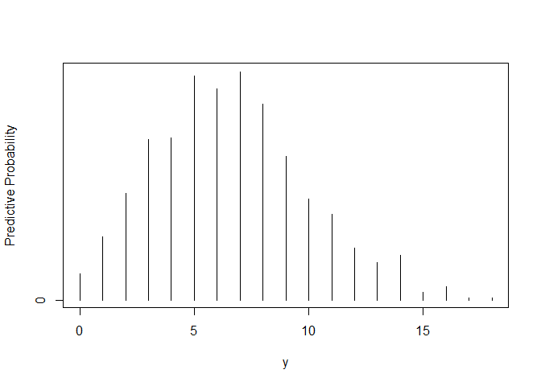

Chapter 2: Introduction to Bayesian Thinking
================
2023-06-10

# 2.2 Learning About the Proportion of Heavy Sleepers

Suppose a person is interested in learning about the sleeping habits of
American college students. She hears that doctors recommend eight hours
of sleep for an average adult. What proportion of college students get
at least eight hours of sleep?

Here we think of a population consisting of all American college
students and let $\large p$ represent the proportion of this population
who sleep (on a typical night during the week) at least eight hours. We
are interested in learning about the location of $\large p$.

Based on some researches, this person believes that college students
generally get less than eight hours of sleep and so $\large p$ (the
proportion that sleep at least eight hours) is likely smaller than .5.
After some reflection, her best guess at the value of $\large p$ is .3.
But it is very plausible that this proportion could be any value in the
interval from 0 to .5.

A sample of 27 students is taken - in this group, 11 record that they
had at least eight hours of sleep the previous night. Based on the prior
information and this observed data, the person is interested in
estimating the proportion $\large p$. In addition, she is interested in
predicting the number of students that get at least eight hours of sleep
if a new sample of 20 students is taken.

Suppose that our prior density for $\large p$ is denoted by
$\large g(p)$. If we regard a “success” as sleeping at least eight hours
and we take a random sample $\large s$ successes and $\large f$
failures, then the likelihood function is given by:
$$\large L(p) = p^{s}(1-p)^{f},\quad 0 < p < 1$$

The posterior density for $\large p$, by Bayes’ rule, is obtained, up to
a proportionality constant, by multiplying the prior density by the
likelihood. $$\large g(p|data) \propto g(p)L(p)$$

# 2.3 Using a Discrete Prior

A simple approach for assessing a prior for $\large p$ is to write down
a list of plausible proportion values and then assign weights to these
values.

``` r
p = seq(0.05, 0.95, by=0.1)    # vector of proportion values
prior = c(2, 4, 8, 8, 4, 2, 1, 1, 1, 1)    # corresponding weights
prior = prior/sum(prior) 
plot(p, prior, type='h',
     ylab="Prior Probability")
title("A discrete prior distribution for a proportion p")
```

<!-- -->

In our example, 11 of 27 students sleep a sufficient number of hours, so
$\large s = 11$ and $\large f = 16$

``` r
library(LearnBayes)

data = c(11, 16) 
post = pdisc(p=p, prior=prior, data=data)
cbind(p, prior, post) 
```

    ##          p   prior         post
    ##  [1,] 0.05 0.06250 2.882642e-08
    ##  [2,] 0.15 0.12500 1.722978e-03
    ##  [3,] 0.25 0.25000 1.282104e-01
    ##  [4,] 0.35 0.25000 5.259751e-01
    ##  [5,] 0.45 0.12500 2.882131e-01
    ##  [6,] 0.55 0.06250 5.283635e-02
    ##  [7,] 0.65 0.03125 2.976107e-03
    ##  [8,] 0.75 0.03125 6.595185e-05
    ##  [9,] 0.85 0.03125 7.371932e-08
    ## [10,] 0.95 0.03125 5.820934e-15

``` r
plot(p, post, type='h',
     ylab="Posterior Probability")
```

<!-- -->

# 2.4 Using a Beta Prior

Since the proportion is a continuous parameter, an alternative approach
is to construct a density $\large g(p)$ on the interval $\large (0, 1)$
that represents the person’s initial beliefs.

Beta distribution density
$$\large g(p) \propto p^{a-1}(1-p)^{b-1}, \quad 0<p<1$$ where the
hyper-parameters $\large a$ and $\large b$ are chosen to reflect the
user’s prior beliefs about $\large p$

The posterior density is also of the beta form with updated parameters:
$$\large g(p) \propto p^{a+s-1}(1-p)^{b+f-1}, \quad 0<p<1$$

``` r
p = seq(0, 1, length=500) 
a = 3.4; b = 7.4    # chosen by trial and error
s = 11; f = 16
prior = dbeta(p, a, b)
like = dbeta(p, s+1, f+1) 
post = dbeta(p, a+s, b+f)
plot(p, post, type='l', ylab="Density", lty=2, lwd=3)
lines(p, like, lty=1, lwd=3)
lines(p, prior, lty=3, lwd=3)
legend(.7, 4,
       c("Prior", "Likelihood", "Posterior"),
       lty=c(3, 1, 2), lwd=c(3, 3, 3))
```

<!-- -->

We illustrate different ways of summarizing the beta posterior
distribution to make inference about the proportion of heavy sleepers
$\large p$. The beta cdf and inverse cdf functions `pbeta` and `qbeta`
are useful in computing probabilities and constructing interval
estimates for $\large p$.

``` r
1 - pbeta(0.5, a+s, b+f)
```

    ## [1] 0.06842569

``` r
qbeta(c(0.05, 0.95), a+s, b+f)
```

    ## [1] 0.2562364 0.5129274

It is unlikely that more than half of the students are heavy sleepers,
and we are 90% confident that the proportion is between .256 and .513.

An alternative method of summarization of a posterior density is based
on simulation. In this case, we can simulate a large number of values
from the beta posterior density and summarize the simulated output.

``` r
# Simulate 1000 random proportion values from the beta(a+s, b+f)
ps = rbeta(1000, a+s, b+f)
# Histogram 
hist(ps, xlab="p", main="")
```

<!-- -->

The probability that the proportion is larger than .5 is estimated by
the proportion of simulated values in this range.

``` r
sum(ps >= 0.5)/1000
```

    ## [1] 0.07

A 90 percent interval estimate can be estimated by the 5th and 95th
sample quantiles of the simulated sample.

``` r
quantile(ps, c(0.05, 0.95))
```

    ##        5%       95% 
    ## 0.2637990 0.5173272

# 2.5 Using a Histogram Prior

We outline a “brute-force” method of summarizing posterior computations
for an arbitrary prior density $\large g(p)$.

- Choose a grid of values of $\large p$ over an interval that covers the
  posterior density.
- Compute the product of the likelihood $\large L(p)$ and the prior
  $\large g(p)$ on the grid.
- Normalize by dividing each product by the sum of the products. In this
  step, we are approximating the posterior density by a discrete
  probability distribution on the grid.
- By use of the R command `sample`, take a random sample with
  replacement from the discrete distribution.

The resulting simulated draws are an approximate sample from the
posterior distribution.

``` r
midpt = seq(0.05, 0.95, by=0.1)    # a vector containing the midpoints of the intervals 
prior = c(2, 4, 8, 8, 4, 2, 1, 1, 1, 1)  # a vector containing the associated prior weights
prior = prior/sum(prior)    # convert to probabilities 
p = seq(0, 1, length=500) 
plot(p, histprior(p, midpt, prior),
     type='l', 
     ylab="Prior density", ylim=c(0, .25))
```

<!-- -->

On the grid of values of $\large p$, we compute the posterior density by
multiplying the histogram prior by the likelihood function.

``` r
like = dbeta(p, s+1, f+1) 
post = like * histprior(p, midpt, prior)

plot(p, post, type='l',
     ylab="Posterior density")
```

<!-- -->

To obtain a simulated sample from the posterior density:

``` r
# Convert the products on the grid to probabilities 
post = post/sum(post) 

# Take a sample with replacement from the grid 
ps = sample(p, replace=TRUE, prob=post) 

# Histogram 
hist(ps, xlab="p")
```

<!-- -->
\# 2.6 Prediction

If the current beliefs about $\large p$ are contained in the density
$\large g(p)$, then the predictive density of $\large \tilde y$ is given
by: $$ \large f(\tilde y) = \int{f(\tilde y | p)g(p) \: \mathrm{d}p}$$

If $\large g$ is a prior density, then we refer to this as the *prior*
predictive density, and if $\large g$ is a posterior, then $\large f$ is
a *posterior* predictive density.

Suppose we use a discrete prior where $\large {p_i}$ represent the
possible values of the proportion with respective probabilities
$\large {g(p_i)}$.

``` r
p = seq(0.05, 0.95, by=.1)    # vector of proportion values 
prior = c(2, 4, 8, 8, 4, 2, 1, 1, 1, 1) 
prior = prior/sum(prior)    # vector of current probabilities 
m = 20; ys = 0:m
pred = pdiscp(p, prior, m, ys) 
plot(ys, pred, type='h') 
title("Discrete prior density")
```

<!-- -->
Suppose instead that we model our beliefs about $\large p$ using a
$\large beta(a,b)$ prior.

``` r
ab = c(3.4, 7.4) 
m = 20; ys = 0:m
pred = pbetap(ab, m, ys) 
plot(ys, pred, type='h')
title("Beta(3.4, 7.4) distribution prior density")
```

<!-- -->
For any prior:

``` r
# First simulate 1000 draws from the prior (beta(3.4, 7.4))
p = rbeta(1000, 3.4, 7.4) 

# Simulate values of predictive y 
y = rbinom(1000, 20, p) 

# Summarize the simulated draws of predictive y and
# Save the frequencies of predictive y 
freq = table(y)
ys = c(0:max(y)) 

# Convert the frequencies to probabilities 
predprob = freq/sum(freq) 

# Visualize 
plot(ys, predprob, type='h', xlab="y",
     ylab="Predictive Probability") 
```

<!-- -->
Suppose we wish to summarize this discrete predictive distribution by an
interval that covers at least 90% of the probability.

``` r
dist = cbind(ys, predprob) 
dist 
```

    ##    ys predprob
    ## 0   0    0.014
    ## 1   1    0.034
    ## 2   2    0.057
    ## 3   3    0.086
    ## 4   4    0.087
    ## 5   5    0.120
    ## 6   6    0.113
    ## 7   7    0.122
    ## 8   8    0.105
    ## 9   9    0.077
    ## 10 10    0.054
    ## 11 11    0.046
    ## 12 12    0.028
    ## 13 13    0.020
    ## 14 14    0.024
    ## 15 15    0.004
    ## 16 16    0.007
    ## 17 17    0.001
    ## 18 18    0.001

``` r
covprob = .9 
discint(dist, covprob) 
```

    ## $prob
    ##     1 
    ## 0.901 
    ## 
    ## $set
    ##  1  2  3  4  5  6  7  8  9 10 11 
    ##  1  2  3  4  5  6  7  8  9 10 11
