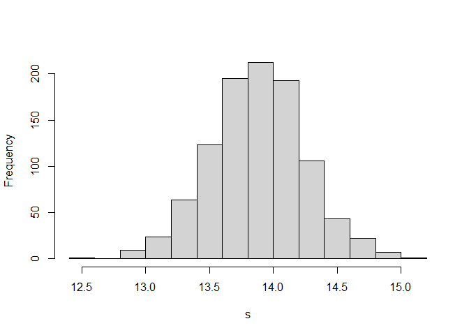
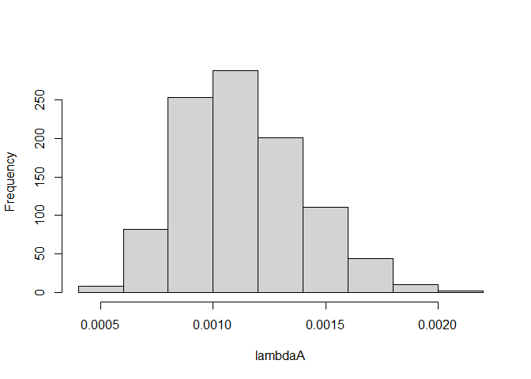
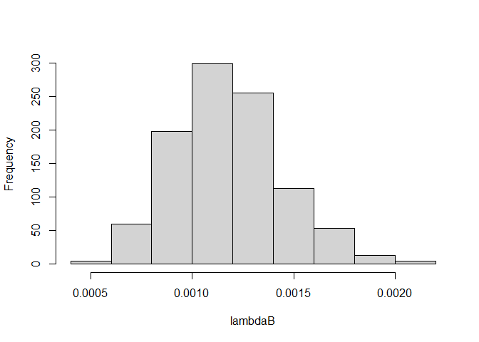
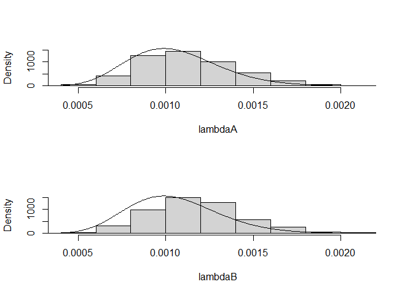

Chapter 3: Single-Parameter Models
================
2023-06-11

# 3.2 Normal Distribution with Known Mean but Unknown Variance

Gelman et al (2003) consider a problem of estimating an unknown variance
using American football scores. The focus is on the difference `d`
between a game outcome (winning score minus losing score) and a
published point spread. We observe $d_1, ..., d_n$, the observed
differences between game outcomes and point spreads for $n$ football
games. If these differences are assumed to be a random sample from a
normal distribution with mean 0 and unknown variance $\sigma ^2$, the
likelihood function is given by
$$\large {L(\sigma ^2) = (\sigma ^2)^{-n/2} exp\{- \sum_{i=1}^{n} \dfrac{d_i^2}{2 \sigma ^2}\}, \quad \sigma ^2 > 0}$$

Suppose the non-informative prior density $p(\sigma ^2) = 1/ \sigma ^2$
is assigned to the variance. Then the posterior density of $\sigma ^2$
is given, up to a proportionality constant, by
$$\large {g(\sigma ^2 | data) \propto (\sigma ^2)^{- \dfrac{n}{2} - 1} exp \{- \dfrac{v}{2 \sigma ^2} \}}$$
where $v = \sum{_{i=1}^{n}} d_i^2$. If we define the precision parameter
$P = 1/ \sigma ^2$, then it can be shown that $P$ is distributed as
$U/v$, where $U$ has a chi-squared distribution with $n$ degrees of
freedom. Suppose we are interested in a point estimate and a 95%
probability interval for the standard deviation $\sigma$.

In the following R output, we first read in the data file
`footballscores` that is available in the `LearnBayes` package. For each
of 672 games, the data file contains `favorite` and `underdog`, the
actual scores of the favorite and underdog teams, and `spread`, the
published point spread. We compute the difference variable `d`. As in
the preceding notation, `n` is the sample size and `v` is the sum of
squares of the differences.

``` r
library(LearnBayes)

data(footballscores)
attach(footballscores)    # make the variables from the data frame visible 

d = favorite - underdog - spread 
n = length(d) 
v = sum(d^2) 
```

We simulate 1000 values from the posterior distribution of the standard
deviation $\sigma$ in two steps.

``` r
# First, simulate values of the precision parameter P from the scaled chi-square(n) distribution 
n_samples = 1000
P = rchisq(n_samples, n)/v

# Obtain the values from the posterior distribution of std 
s = sqrt(1/P) 

# Construct a histogram of the draws 
hist(s, main="")
```

<!-- -->

Extract the 2.5%, 50%, and 97.5% percentiles of this simulated sample.

``` r
quantile(s, probs=c(0.025, 0.5, 0.975))
```

    ##     2.5%      50%    97.5% 
    ## 13.14853 13.86086 14.63380

# 3.3 Estimating a Heart Transplant Mortality Rate

A standard model assumes that the number of deaths $y$ follows a Poisson
distribution with mean $e \lambda$, and the objective is to estimate the
mortality rate per unit exposure $\lambda$.

``` r
# Define parameters for Hospital A
alpha = 16; beta = 15174 
yobs = 1    # number of deaths observed
ex = 66     # exposure 
y = 0:10 
lam = alpha/beta 

# Predictive distribution 
py = dpois(y, lam*ex) * dgamma(lam, shape=alpha,
                               rate=beta)/dgamma(lam,
                                                 shape=alpha+y,
                                                 rate=beta+ex)
cbind(y, round(py, 3))
```

    ##        y      
    ##  [1,]  0 0.933
    ##  [2,]  1 0.065
    ##  [3,]  2 0.002
    ##  [4,]  3 0.000
    ##  [5,]  4 0.000
    ##  [6,]  5 0.000
    ##  [7,]  6 0.000
    ##  [8,]  7 0.000
    ##  [9,]  8 0.000
    ## [10,]  9 0.000
    ## [11,] 10 0.000

The posterior density of $\lambda$ can be summarized by simulating 1000
values from the gamma density.

``` r
lambdaA = rgamma(1000, shape=alpha+yobs, rate=beta+ex) 
hist(lambdaA, main="")
```

<!-- -->

``` r
# For Hospital B 
ex = 1767; yobs = 4
y = 0:10 
py = dpois(y, lam*ex) * dgamma(lam,
                               shape=alpha,
                               rate=beta) / dgamma(lam,
                                                   shape=alpha+y,
                                                   rate=beta+ex)
cbind(y, round(py, 3))
```

    ##        y      
    ##  [1,]  0 0.172
    ##  [2,]  1 0.286
    ##  [3,]  2 0.254
    ##  [4,]  3 0.159
    ##  [5,]  4 0.079
    ##  [6,]  5 0.033
    ##  [7,]  6 0.012
    ##  [8,]  7 0.004
    ##  [9,]  8 0.001
    ## [10,]  9 0.000
    ## [11,] 10 0.000

``` r
lambdaB = rgamma(1000, shape=alpha+yobs, rate=beta+ex) 
hist(lambdaB, main="")
```

<!-- -->

To see the impact of the prior density on the inference, it is helpful
to display the prior and posterior distributions on the same graph.

``` r
lambda = seq(0, max(c(lambdaA, lambdaB)), length=500)
par(mfrow=c(2, 1))
hist(lambdaA, freq=FALSE, main="", ylim=c(0, 1500))
lines(lambda, dgamma(lambda, shape=alpha, rate=beta))
hist(lambdaB, freq=FALSE, main="", ylim=c(0, 1500))
lines(lambda, dgamma(lambda, shape=alpha, rate=beta))
```

<!-- -->

# 3.4 An Illustration of Bayesian Robustness

Suppose you are interested in estimating the true IQ $\theta$ for a
person called Joe. You believe Joe has an average intelligence and the
median of your prior distribution is 100. Also you are 90% confident
that Joe’s IQ falls between 80 and 120. You construct a prior density by
matching this information with a normal density with mean $\mu$ and
standard deviation $\tau$, or $N(\mu, \tau)$.

Joe takes four IQ tests and his scores are $y_1, y_2, y_3. y_4$.
Assuming that an individual score $y$ is distributed $N(\theta, \sigma)$
with know standard deviation $\sigma = 15$, the observed mean score
$\bar y$ is $N(\theta, \sigma / \sqrt{4})$.

With the use of a normal prior in this case, the posterior density of
$\theta$ will also be normal with standard deviation
$$\large {\tau _1 = \dfrac{1}{\sqrt {4/ \sigma ^2 + 1/ \tau ^2}}}$$ and
mean
$$\large {\mu _1 = \dfrac{\bar{y}(4/ \sigma ^2) + \mu (1/ \tau ^2)}{4/ \sigma ^2 + 1/ \tau ^2}}$$

We illustrate the posterior calculations for three hypothetical test
results for Joe. we suppose that the observed mean test score is
$\bar y = 110$, or $\bar y = 125$, or $\bar y = 140$.

``` r
mu = 100
tau = 12.16
sigma = 15 
n = 4 
se = sigma/sqrt(4) 
ybar = c(110, 125, 140) 
tau1 = 1/sqrt(1/se^2 + 1/tau^2) 
mu1 = (ybar/se^2 + mu/tau^2) * tau1^2 
summ1 = cbind(ybar, mu1, tau1) 
summ1 
```

    ##      ybar      mu1     tau1
    ## [1,]  110 107.2442 6.383469
    ## [2,]  125 118.1105 6.383469
    ## [3,]  140 128.9768 6.383469

Let’s now consider an alternative prior density to model our beliefs
about Joe’s true IQ. Any symmetric density instead of a normal could be
used, so we use a t density with location $\mu$, scale $\tau$, and two
degrees of freedom. Since our prior median is 100, we let the median of
our t density be $\mu = 100$. We find the scale parameter $\tau$ so the
t density matches our prior belief that the 95th percentile of $\theta$
is equal to 120.

``` r
# Find the scale parameter 
tscale = 20/qt(0.95, 2)  # 95% percentile, 2 degrees of freedom
tscale 
```

    ## [1] 6.849349

``` r
# Note that the t density has significantly flatter tails 
theta = seq(60, 140, length=200)
plot(theta, 1/tscale*dt((theta-mu)/tscale, 2),
     type='l', ylab="Prior Density")
lines(theta, 1/10*dnorm((theta-mu)/tau), lwd=3)
legend("topright", legend=c("t density", "normal density"),
       lwd=c(1,3))
```

<!-- -->

We perform the posterior calculations using the t prior for each of the
possible sample results. The posterior density of $\theta$ is given, up
to a proportionality constant, by:
$$\large {g(\theta | data) \propto \phi (\bar y | \theta, \sigma / \sqrt{n})g_T(\theta | v, \mu, \tau)}$$
where $\phi (y | \theta, \sigma)$ is a normal density with mean $\theta$
and standard deviation $\sigma$, and $g_T(\mu | v, \mu, \tau)$ is a t
density with median $\mu$, scale parameter $\tau$ and degree of freedom
$v$.

``` r
summ2 = c() 
for (i in 1:3) {
    theta = seq(60, 180, length=500)
    like = dnorm((theta - ybar[i]) / 7.5)
    prior = dt((theta - mu)/tscale, 2) 
    post = prior * like 
    post = post/sum(post) 
    m = sum(theta * post) 
    s = sqrt(sum(theta^2 * post) - m^2)
    summ2 = rbind(summ2, c(ybar[i], m, s))
}
summ2 
```

    ##      [,1]     [,2]     [,3]
    ## [1,]  110 105.2921 5.841676
    ## [2,]  125 118.0841 7.885174
    ## [3,]  140 135.4134 7.973498

Let’s compare the posterior moments of $\theta$ using the two priors.

``` r
cbind(summ1, summ2)
```

    ##      ybar      mu1     tau1                      
    ## [1,]  110 107.2442 6.383469 110 105.2921 5.841676
    ## [2,]  125 118.1105 6.383469 125 118.0841 7.885174
    ## [3,]  140 128.9768 6.383469 140 135.4134 7.973498

Visualizing the “extreme” case where $\bar y = 140$

``` r
normpost = dnorm(theta, mu1[3], tau1) 
normpost = normpost/sum(normpost) 
plot(theta, normpost, type='l', lwd=3,
     ylab="Posterior Density") 
lines(theta, post) 
legend("topleft", legend=c("t prior", "normal prior"), lwd=c(1,3))
```

<!-- -->

When a normal prior is used, the posterior will always be a compromise
between the prior information and the observed data, even when the data
result conflicts with one’s prior beliefs about the location of Joe’s
IQ. In contrast, when a t prior is used, the likelihood will be in the
flat-tailed portion of the prior and the posterior will resemble the
likelihood function.

# 3.5 A Bayesian Test for the Fairness of a Coin

Suppose you are interested in assessing the fairness of a coin. You
observe $y$ distributed binomial with parameters $n$ and $p$ and you are
interested in testing the hypothesis H that $p = .5$.

From a Bayesian perspective, there are two possible models here - either
the coin is fair ($p = .5$) or the coin is not fair ($p \neq .5$).
Suppose that you are indifferent between the two possibilities, and so
you initially assign each model a probability of 1/2. Now if you believe
the coin is fair, then your entire prior distribution for $p$ would be
concentrated on the value $p = .5$. If instead the coin is unfair, you
would assign a different prior distribution on $(0,1)$, call it
$g_1(p)$, that would reflect your beliefs about the unfair coin
probability. Suppose you assign a $beta(a, a)$ prior on $p$. To
summarize, your prior distribution in this testing situation can be
written $$\large {g(p) = .5I(p = .5) + .5I(p \neq .5)g_1(p)}$$ where
$I(A)$ is an indicator function equal to 1 if the event A is true and
otherwise equal to 0.

After observing the number of heads in $n$ tosses, the posterior density
for $p$ can be written as
$$\large {g(p | y) = \lambda (y)I(p = .5) + (1 - \lambda (y))g_1(p | y)}$$
where $g_1$ is a $beta(a+y, a+n-y)$ density and $\lambda (y)$ is the
posterior probability of the model that the coin is fair
$$\large {\lambda (y) = \dfrac{.5p(y | .5)}{.5p(y | .5) + .5m_1(y)}}$$

In the expression for $\lambda (y)$, $p(y | .5)$ is the binomial density
for y when $p = .5$ and $m_1(y)$ is the (prior) predictive density for y
using the beta density.

The predictive density for $y$ can be computed using the identity
$$\large {m_1(y) = \dfrac{f(y | p)g_1(p)}{g_1(p | y)}}$$.

``` r
n = 20    # Number of tosses 
y = 5     # 5 heads observed
a  = 10   # beta distribution parameters
p = 0.5 
m1 = dbinom(y, n, p) * dbeta(p, a, a)/dbeta(p, a+y, a+n-y)
lambda = dbinom(y, n, p)/(dbinom(y, n, p) + m1)
lambda 
```

    ## [1] 0.2802215

We get the surprising result that the posterior probability of the
hypothesis of fairness H is .28, which is against fairness.

``` r
# From LearnBayes library 
pbetat(p0=p, prob=.5, ab=c(a,a), data=c(y, n-y))
```

    ## $bf
    ## [1] 0.3893163
    ## 
    ## $post
    ## [1] 0.2802215

The output variable `post` is the posterior probability that $p = .5$,
which agrees with the calculation. The output variable `bf` is the Bayes
factor in support of the null hypothesis.

Since the choice of the prior parameter $a = 10$ in this analysis seems
arbitrary, it is natural to ask about the sensitivity of this posterior
calculation to the choice of this parameter.

``` r
loga = seq(-4, 5, length=100) 
a = exp(loga)
m2 = dbinom(y, n, p) * dbeta(p, a, a)/dbeta(p, a+y, a+n-y)
lambda = dbinom(y, n, p)/(dbinom(y, n, p) + m2)
plot(loga, lambda, type="l", 
     xlab="log(a)", ylab="Prob(coin is fair)")
```

<!-- -->
If we observed “5 heads or fewer”, the posterior probability that the
coin is fair is given by
$$\large {\lambda (y) = \dfrac{.5P_0(Y \leq 5)}{.5P_0(Y \leq 5) + .5P_1(y \leq 5)}}$$
where $P_0(Y \leq 5)$ is the propbability of five heads or fewer under
the binomial model with $p = .5$ and $P_1(Y \leq 5)$ is the predictive
probability of this event under the alternative model with a
$beta(10, 10)$ prior on $p$.

``` r
n = 20
y = 5 
a = 10 
p = .5 
m2 = 0 
for (k in 0:y){
    m2 = m2 + dbinom(k,n,p)*dbeta(p,a,a)/dbeta(p,a+k,a+n-k)
}
lambda = pbinom(y, n, p)/(pbinom(y, n, p) + m2)
lambda 
```

    ## [1] 0.2184649
