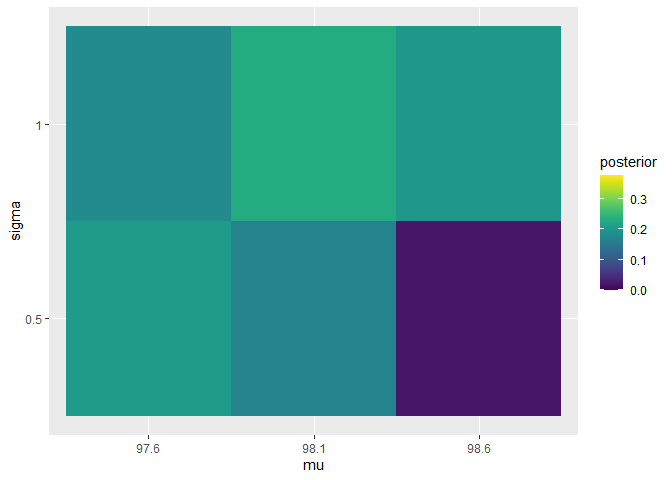
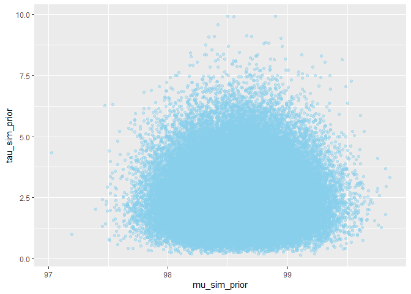
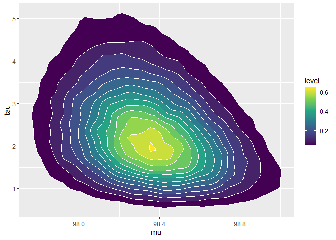

Chapter 4: Multiparameter Models
================
2023-06-15

# 4.2 Normal Data with Both Parameters Unknown

Suppose we are interested in learning about the distribution of
completion times for men between ages 20 and 29 who are running the New
York Marathon. we observe the times $y_1, ..., y_20$ for 20 runners in
minutes, and we assume they represent a random sample from an
$\mbox{N}(\mu, \sigma)$ distribution. If we assume the standard
non-informative prior $g(\mu, \sigma ^2) \propto 1/ \sigma ^2$, then the
posterior density of the mean and variance is given by
$$\large {g(\mu, \sigma ^2 | y) \propto \dfrac{1}{(\sigma ^2)^{n/2 + 1}}exp(-\dfrac{1}{2\sigma ^2}(S + n(\mu - \bar y)^2))}$$
where $n$ is the sample size, $\bar y$ is sample mean, and
$S = \sum{_{i=1}^{n}{(y_i - \bar y)^2}}$.

This joint posterior has the familiar normal/inverse chi-square form
where:

- the posterior of $\mu$ conditional on $\sigma ^2$ is distributed
  $\mbox{N}(\bar y, \sigma /\sqrt{n})$
- the marginal posterior of $\sigma ^2$ is distributed
  $S_{\chi_{n-1}^{-2}}$ where $\chi^{-2}_{\nu}$ denotes an inverse
  chi-square distribution with $\nu$ degrees of freedom.

We first use R to construct a contour plot of the joint posterior
density for this example.

``` r
library(LearnBayes) 

# Read data and attach variables 
data(marathontimes)
attach(marathontimes) 

# Function from the library 
mycontour(normchi2post, 
          c(220, 330, 500, 9000),
          time) 
title(xlab="mean", ylab="variance")
```

<!-- -->

It is convenient to summarize this posterior distribution by simulation.
One can simulate a value of $(\mu, \sigma ^2)$ from the joint posterior
by first simulating $\sigma ^2$ from an $S_{\chi _{n-1}^{-2}}$
distribution and then simulating $\mu$ from the
$\mbox{N}(\bar y, \sigma /\sqrt{n})$ distribution.

``` r
# Sample from chi-squared distribution and obtain draws from the scale times inverse chi-square 
S = sum((time - mean(time))^2)
n = length(time) 
sigma2 = S/rchisq(1000, n-1)

# Simulated draws of the mean 
mu = rnorm(1000,
           mean=mean(time),
           sd=sqrt(sigma2)/sqrt(n))

# Display the simulated sampled values on top of the contour plot
mycontour(normchi2post, 
          c(220, 330, 500, 9000),
          time) 
title(xlab="mean", ylab="variance")
points(mu, sigma2)
```

<!-- -->

``` r
# 95% interval estimate for the mean 
quantile(mu, c(0.025, 0.975))
```

    ##     2.5%    97.5% 
    ## 255.8406 301.7288

A 95% credible interval for the mean completion time is (255.63, 302.36)
minutes.

Suppose we are interested in learning about the standard deviation
$\sigma$ that describes the spread of the population of marathon running
times. To obtain a sample of the posterior of $\sigma$, we take square
roots of the simulated draws of $\sigma ^2$.

``` r
quantile(sqrt(sigma2), c(0.025, 0.975))
```

    ##     2.5%    97.5% 
    ## 37.75372 70.98069

From the output, we see that an approximate 95% probability interval for
$\sigma$ is (37.74, 72.96) minutes.

# 4.4 A Bioassay Experiment

We consider data from Gelman et al (2003), where one observes a dose
level (in log g/ml), the number of animals, and the number of deaths for
each of four group.

| Dose  | Deaths | Sample size |
|:-----:|:------:|:-----------:|
| -0.86 |   0    |      5      |
| -0.30 |   1    |      5      |
| -0.05 |   3    |      5      |
| 0.73  |   5    |      5      |

Let $y_i$ denote the number of deaths observed out of $n_i$ with dose
level $x_i$. We assume $y_i$ is $\mbox{binomial}(n_i, p_i)$, where the
probability $p_i$ follows the logistic model
$$\large {log(\dfrac{p_i}{1-p_i}) = \beta _0 + \beta _1 x_i}$$

The likelihood function of the unknown regression parameters $\beta_0$ and $\beta_1$ is given by $$\large {L(\beta_0, \beta_1) = \prod{_{i=1}^{4}{p_i^{y_i} (1-p_i)^{n_i-y_i}}}}$$
where $p_i = exp(\dfrac{\beta_0 + \beta_1 x_i}{1 + exp(\beta_0 + \beta_1 x_i)})$.

If the standard flat non-informative prior is placed on
$(\beta _0, \beta _1)$, then the posterior density is proportional to
the likelihood function.

``` r
# Covariate vector 
x = c(-0.86, -0.3, -0.05, 0.73)

# Vector of sample sizes 
n = c(5, 5, 5, 5)

# Observed success counts 
y = c(0, 1, 3, 5)

data = cbind(x, n, y) 
```

A standard classical analysis fits the model by maximum likelihood.

``` r
response = cbind(y, n-y) 
results = glm(response ~ x, family=binomial)
summary(results)
```

    ## 
    ## Call:
    ## glm(formula = response ~ x, family = binomial)
    ## 
    ## Deviance Residuals: 
    ##        1         2         3         4  
    ## -0.17236   0.08133  -0.05869   0.12237  
    ## 
    ## Coefficients:
    ##             Estimate Std. Error z value Pr(>|z|)
    ## (Intercept)   0.8466     1.0191   0.831    0.406
    ## x             7.7488     4.8728   1.590    0.112
    ## 
    ## (Dispersion parameter for binomial family taken to be 1)
    ## 
    ##     Null deviance: 15.791412  on 3  degrees of freedom
    ## Residual deviance:  0.054742  on 2  degrees of freedom
    ## AIC: 7.9648
    ## 
    ## Number of Fisher Scoring iterations: 7

To summarize the posterior distribution, we first find a rectangle that
covers essentially all of the posterior probability.

``` r
mycontour(logisticpost, 
          c(-4, 8, -5, 39),
          data)
title(xlab="beta0", ylab="beta1")

# Simulate from the posterior density computed on this rectangle grid 
s = simcontour(logisticpost, 
               c(-4, 8, -5, 39),
               data, 1000)
points(s$x, s$y)
```

<!-- -->

A density estimate of the simulated values of the slope parameter
$\beta _1$.

``` r
plot(density(s$y), xlab="beta1", main="")
```

<!-- -->

In this setting, one parameter of interest is the LD-50, the value of
the dose $x$ such that the probability of death is equal to one half. It
is straightforward to show that the LD-50 is equal to
$\theta = -\beta _0 / \beta _1$. One can obtain a simulated sample from
the marginal posterior density of $\theta$ by computing a value of
$\theta$ from each simulated pair $(\beta _0 , \beta _1)$.

``` r
theta = -s$x/s$y 
hist(theta, breaks=30, xlab="LD-50", main="")
```

<!-- -->

``` r
quantile(theta, c(.025, .975))
```

    ##        2.5%       97.5% 
    ## -0.28352780  0.08917603

# Examples

REFERENCE: [An Introduction to Bayesian Reasoning and
Methods](https://bookdown.org/kevin_davisross/bayesian-reasoning-and-methods/)

## Example 14.1:

Assume body temperatures (degrees Fahrenheit) of healthy adults follows
a Normal distribution with unknown mean $\mu$ and unknown standard
deviation $\sigma$. Suppose we wish to estimate both $\mu$, the
population mean healthy human body temperature, and $\sigma$, the
population standard deviation of body temperatures.

1.  Assume a discrete prior distribution according to which

- $\mu$ takes values 97.6, 98.1, 98.6 with prior probability 0.2, 0.3,
  0.5, respectively.
- $\sigma$ takes values 0.5, 1 with prior probability 0.25, 0.75,
  respectively.
- $\mu$ and $\sigma$ are independent..

Start to construct Bayes table. What are the possible values of the
parameter? What are the prior probability?

2.  Suppose two temperatures of 97.5 and 97.9 are observed,
    independently. Identify the likelihood.

3.  Complete the Bayes table and find the posterior distribution after
    observing these two measurements. Compare to the prior distribution.

4.  Suppose that we only observe that in a sample size of 2 the mean is
    97.7. Is this information enough to evaluate the likelihood function
    and determine the posterior distribution?

5.  The prior assumes that $\mu$ and $\sigma$ are independent. Are they
    independent according to the posterior distribution?

**Solution**

``` r
mu = c(97.6, 98.1, 98.6)
sigma = c(0.5, 1) 
theta = expand.grid(mu, sigma)  # all possible (mu, sigma) pairs 
names(theta) = c("mu", "sigma") 

# Prior 
prior_mu = c(0.20, 0.30, 0.50) 
prior_sigma = c(.25, .75) 
prior = apply(expand.grid(prior_mu, prior_sigma),
              1, prod)
prior = prior/sum(prior) 

# Data 
y = c(97.9, 97.5)  # single observed data

# Likelihood 
likelihood = dnorm(97.9, mean=theta$mu, sd=theta$sigma) * 
    dnorm(97.5, mean=theta$mu, sd=theta$sigma) 

# Posterior
product = likelihood * prior
posterior = product/sum(product) 

# Bayes table 
bayes_table = data.frame(theta,
                         prior,
                         likelihood,
                         product,
                         posterior)
knitr::kable(bayes_table, digits=4, align='c')
```

|  mu  | sigma | prior | likelihood | product | posterior |
|:----:|:-----:|:-----:|:----------:|:-------:|:---------:|
| 97.6 |  0.5  | 0.050 |   0.5212   | 0.0261  |  0.2041   |
| 98.1 |  0.5  | 0.075 |   0.2861   | 0.0215  |  0.1680   |
| 98.6 |  0.5  | 0.125 |   0.0212   | 0.0027  |  0.0208   |
| 97.6 |  1.0  | 0.150 |   0.1514   | 0.0227  |  0.1778   |
| 98.1 |  1.0  | 0.225 |   0.1303   | 0.0293  |  0.2296   |
| 98.6 |  1.0  | 0.375 |   0.0680   | 0.0255  |  0.1997   |

Intuitively, knowing only the posterior mean would not be sufficient,
since it would not give us enough information to estimate the standard
deviation $\sigma$. In order to evaluate the likelihood we need to
compute $\dfrac{y - \mu}{\sigma}$ for each individual $y$ value, so if
we only had the sample mean, we would not be able to fill in the
likelihood column.

The posterior distribution represents some dependence between $\mu$ and
$\sigma$.

``` r
library(ggplot2)
```

    ## Warning: package 'ggplot2' was built under R version 4.2.3

``` r
library(dplyr)
```

    ## Warning: package 'dplyr' was built under R version 4.2.3

    ## 
    ## Attaching package: 'dplyr'

    ## The following objects are masked from 'package:stats':
    ## 
    ##     filter, lag

    ## The following objects are masked from 'package:base':
    ## 
    ##     intersect, setdiff, setequal, union

``` r
library(viridis)
```

    ## Warning: package 'viridis' was built under R version 4.2.3

    ## Loading required package: viridisLite

    ## Warning: package 'viridisLite' was built under R version 4.2.3

``` r
ggplot(bayes_table %>% 
           mutate(mu=factor(mu),
                  sigma=factor(sigma)),
       aes(mu, sigma)) + 
    geom_tile(aes(fill=prior)) + 
    scale_fill_viridis(limits=c(0, max(c(prior, posterior))))
```

<!-- -->

``` r
ggplot(bayes_table %>% 
           mutate(mu=factor(mu),
                  sigma=factor(sigma)),
       aes(mu, sigma)) + 
    geom_tile(aes(fill=posterior)) + 
    scale_fill_viridis(limits=c(0, max(c(prior, posterior))))
```

<!-- -->

## Example 14.2:

Continuing Example 14.1, let’s assume a more reasonable continuous prior
for $(\mu, \sigma)$. We have seen that we often with the precision
$\tau = 1/ \sigma ^2$ rather than the SD. Assume a continuous prior
distribution which assumes:

- $\mu$ has a Normal distribution with mean 98.6 and standard deviation
  0.3.
- $\tau$ has a Gamma distribution with shape parameter 5 and rate
  parameter 2.
- $\mu$ and $\tau$ are independent.

1.  Simulate $(\mu, \tau)$ pairs from the prior distribution and plot
    them.

``` r
Nrep = 100000

mu_sim_prior = rnorm(Nrep, 98.6, 0.3)
tau_sim_prior = rgamma(Nrep, shape=5, rate=2)
sigma_sim_prior = 1/sqrt(tau_sim_prior)
sim_prior = data.frame(mu_sim_prior,
                       tau_sim_prior,
                       sigma_sim_prior)

# Plot 
ggplot(sim_prior, aes(mu_sim_prior, tau_sim_prior)) + 
    geom_point(color="skyblue", alpha=0.4)
```

<!-- -->

``` r
ggplot(sim_prior, aes(mu_sim_prior, tau_sim_prior)) + 
    stat_density_2d(aes(fill=after_stat(level)),
                    geom="polygon", color="white") +
    scale_fill_viridis_c()
```

<!-- -->

2.  Simulate $(\mu, \sigma)$ pairs from the prior distribution and plot
    them. Describe the prior distribution of $\sigma$.

``` r
ggplot(sim_prior, aes(x=sigma_sim_prior)) + 
    geom_histogram(aes(y=after_stat(density)), color="black", fill="white") + 
    geom_density(linewidth=1, color="skyblue")
```

    ## `stat_bin()` using `bins = 30`. Pick better value with `binwidth`.

<!-- -->

``` r
ggplot(sim_prior, aes(mu_sim_prior, sigma_sim_prior)) + 
    stat_density_2d(aes(fill=after_stat(level)),
                    geom="polygon", color="white") + 
    scale_fill_viridis_c()
```

<!-- -->

3.  Find and interpret a central 98% prior credible interval for $\mu$

``` r
quantile(mu_sim_prior, c(0.01, 0.99))
```

    ##       1%      99% 
    ## 97.90551 99.29612

4.  Find a central 98% prior credible interval for the precision
    $\tau = 1/ \sigma ^2$.

``` r
quantile(tau_sim_prior, c(.01, .99))
```

    ##        1%       99% 
    ## 0.6390629 5.8343028

5.  Find and interpret a central 98% prior credible interval for
    $\sigma$.

``` r
quantile(sigma_sim_prior, c(.01, .99))
```

    ##        1%       99% 
    ## 0.4140049 1.2509161

6.  What is the prior credibility that both $\mu$ and $\sigma$ lie
    within their credible intervals?

**Answer:** Since $\mu$ and $\sigma$ are independent according to the
prior distribution, the probability that both parameters lie in their
respective intervals is $(0.98)(0.98)=0.9604$. If we want 98% joint
prior credibility, we need a different region.

## Example 14.3;

Continue the previous example, we’ll now compute the posterior
distribution given a sample of two measurements of 97.9 and 97.5.

1.  Assume a grid of $\mu$ values from 96.0 to 100.0 in increments of
    0.01, and a grid of $\tau$ values from 0.1 to 25.0 in increments of
    0.01. How many possible values of the pair $(\mu, \tau)$ are there;
    that is, how many rows are there in the Bayes table?

**Answer:** There are $(100-96)/0.01 = 400$ values of $\mu$ in the grid
(actually 401 including both endpoints) and $(25-0.1)/0.01 = 2490$
values of $\tau$ in the grid (actually 2491). Thus, there are almost 1
million possible values of the pair $(\mu, \tau)$ in the grid.

2.  Use grid approximation to approximate the joint posterior
    distribution of (𝜇, 𝜏) Simulate values from the joint posterior
    distribution and plot them. Compute the posterior correlation
    between 𝜇 and 𝜏; are they independent according to the posterior
    distribution?

``` r
# Parameters 
mu = seq(96.0, 100.0, by=0.01)
tau = seq(0.1, 25, by=0.01)

theta = expand.grid(mu, tau) 
names(theta) = c("mu", "tau")
theta$sigma  = 1/sqrt(theta$tau)

# Prior 
prior_mu_mean = 98.6 
prior_mu_sd = 0.3 

prior_precision_shape = 5
prior_precision_rate = 2

prior = dnorm(theta$mu, mean=prior_mu_mean, sd=prior_mu_sd) * 
    dgamma(theta$tau, shape=prior_precision_shape,
           rate=prior_precision_rate)
prior = prior/sum(prior)

# Data 
y = c(97.9, 97.5)

# Likelihood 
likelihood = dnorm(97.9, mean=theta$mu, sd=theta$sigma) * 
    dnorm(97.5, mean=theta$mu, sd=theta$sigma)

# Posterior 
product = likelihood * prior 
posterior = product/sum(product)

# Posterior simulation 
sim_posterior = theta[sample(1:nrow(theta), 100000,
                             replace=TRUE, prob=posterior), ]
cor(sim_posterior$mu, sim_posterior$tau)
```

    ## [1] -0.2929104

``` r
ggplot(sim_posterior, aes(mu)) + 
    geom_histogram(aes(y=after_stat(density)), color="black", fill="white") + 
    geom_density(linewidth=1, color="seagreen")
```

    ## `stat_bin()` using `bins = 30`. Pick better value with `binwidth`.

<!-- -->

``` r
ggplot(sim_posterior, aes(tau)) + 
    geom_histogram(aes(y=after_stat(density)), color="black", fill="white") + 
    geom_density(linewidth=1, color="seagreen")
```

    ## `stat_bin()` using `bins = 30`. Pick better value with `binwidth`.

<!-- -->

``` r
ggplot(sim_posterior, aes(mu, tau)) + 
    stat_density_2d(aes(fill=after_stat(level)),
                    geom="polygon", color="white") + 
    scale_fill_viridis_c()
```

<!-- -->

3.  Plot the simulated joint posterior distribution of 𝜇 and 𝜎. Compare
    to the prior.

``` r
cor(sim_posterior$mu, sim_posterior$sigma)
```

    ## [1] 0.2854639

``` r
ggplot(sim_posterior, aes(mu)) + 
    geom_histogram(aes(y=after_stat(density)), color="black", fill="white") + 
    geom_density(linewidth=1, color="seagreen")
```

    ## `stat_bin()` using `bins = 30`. Pick better value with `binwidth`.

<!-- -->

``` r
ggplot(sim_posterior, aes(sigma)) + 
    geom_histogram(aes(y=after_stat(density)), color="black", fill="white") + 
    geom_density(linewidth=1, color="seagreen")
```

    ## `stat_bin()` using `bins = 30`. Pick better value with `binwidth`.

<!-- -->

``` r
ggplot(sim_posterior, aes(mu, sigma)) + 
    stat_density_2d(aes(fill=after_stat(level)),
                    geom="polygon", color="white") + 
    scale_fill_viridis_c()
```

<!-- -->

4.  Suppose we wanted to approximate the posterior distribution without
    first using grid approximation. Describe how, in principle, you
    would use a naive (non-MCMC) simulation to approximate the posterior
    distribution. In practice, what is the problem with such a
    simulation?

**Answer:**

A naive (non-MCMC) simulation:

- Simulate a value of $(\mu, \sigma)$ from their joint prior
  distribution, by simulating a value of $\mu$ from a
  $\mbox{Normal}(98.6, 0.3)$ distribution and simulating, independently,
  a value of $\tau$ from a $\mbox{Gamma}(5, 2)$ distribution and setting
  $\sigma = 1 / \sqrt{\tau}$.
- Given $\mu$ and $\sigma$ simulate two independent $y$ values from a
  $\mbox{Normal}(\mu, \sigma)$ distribution.
- Repeat many times.
- Condition on the observed data by discarding any repetitions for which
  the $y$ values are not (97.9, 97.5), to some reasonable degree of
  precision.
- Approximate the posterior distribution using the remaining simulated
  values of $(\mu, \sigma)$.

In practice, the probability of seeing a sample with $y$ values of 97.9
and 97.5 is extremely small, so almost all repetitions of the simulation
would be discarded and such a simulation would be extremely
computationally inefficient.
