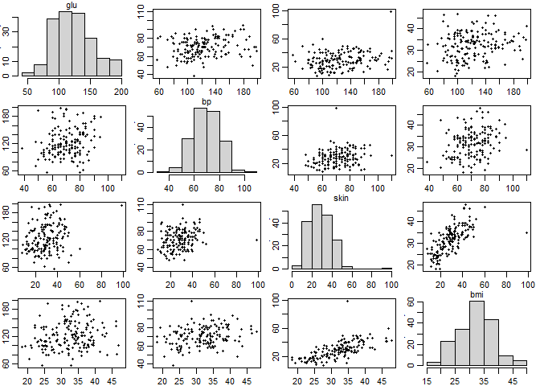
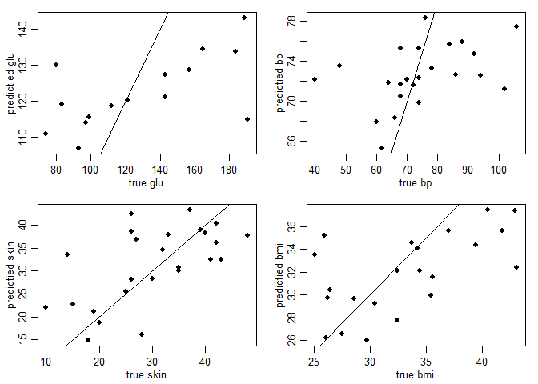

Chapter 7: The Multivariate Normal Model
================
2023-06-16

Reference: [A First Course in Bayesian Statistical Methods]()

# Example: Reading Comprehension

A sample of twenty-two children are given reading comprehension tests
before and after receiving a particular instructional method. each
student $i$ will then have two scores, $Y_{i,1}$ and $Y_{i,2}$ denoting
the pre- and post-instructional scores, respectively. We denote each
student’s pair of scores as a $2 \times 1$ vector $\textbf {Y}_i$, so
that

$$
\textbf {Y}_i = 
    \begin{pmatrix}
    Y_{i, 1} \\
    Y_{i, 2}
    \end{pmatrix}
= 
\begin{pmatrix}
score \: on \: first \: test \\
score \: on \: second \: test
\end{pmatrix}
$$

Things we might be interested in include the population mean
$\pmb {\theta}$

$$
E[\textbf {Y}] =
\begin{pmatrix}
    E[Y_{i,1}] \\
    E[Y_{i,2}]
\end{pmatrix}
=
\begin{pmatrix}
    \theta _1 \\
    \theta _2
\end{pmatrix}
$$

and the population covariance matrix $\Sigma$

$$
\Sigma  = Cov[\textbf {Y}] = 
\begin{pmatrix}
    E[Y_1^2]-E[Y_1]^2 & E[Y_1 Y_2]-E[Y_1]E[Y_2] \\
    E[Y_1 Y_2]-E[Y_1]E[Y_2] & E[Y_2 ^2]-E[Y_2]^2
\end{pmatrix}
=
\begin{pmatrix}
    \sigma_1 ^2 & \sigma_{1,2} \\
    \sigma_{1,2} & \sigma_2 ^2
\end{pmatrix}
$$

where the expectations above represent the unknown population averages.

**Prior Conditions**

- $\pmb {\mu}_0 = (50, 50)^T$
- The true mean cannot below 0 or above 100 $\Rightarrow$ it is
  desirable to use a prior variance for $\pmb {\theta}$ that puts little
  possibility outside of this range.
- Prior variances on $\theta_1$ and $\theta_2$:
  $\lambda_{0,1}^2 = \lambda_{0,2}^2 = (50/2)^2 = 625$
- $\lambda_{1,2} = 312.5$, prior correlation of 0.5
- $\nu_0 = p+2=4$

``` r
library(mvtnorm)
```

    ## Warning: package 'mvtnorm' was built under R version 4.2.3

``` r
rm(list=ls(all=TRUE))

Y = dget("http://www2.stat.duke.edu/~pdh10/FCBS/Inline/Y.reading")


mu0 = c(50,50)
L0 = matrix( c(625,312.5,312.5,625),nrow=2,ncol=2)  

nu0 = 4
S0 = matrix( c(625,312.5,312.5,625),nrow=2,ncol=2)   # prior residual sum of squares

n = nrow(Y)  
ybar = apply(Y, 2, mean)
Sigma = cov(Y)  # set sigma = sample covariance matrix 
THETA = SIGMA = NULL
YS = NULL
set.seed(1)

for(s in 1:5000) 
{
 
  ### Update theta
  Ln = solve( solve(L0) + n*solve(Sigma) )
  mun  = Ln%*%( solve(L0)%*%mu0 + n*solve(Sigma)%*%ybar )
  theta  = rmvnorm(1,mun,Ln)  
   
  ### Update Sigma
  Sn = S0 + ( t(Y)-c(theta) )%*%t( t(Y)-c(theta) ) 
  Sigma = solve( rWishart(1, nu0+n+1, solve(Sn))[,,1] )
  ###

  ###
  YS = rbind(YS,rmvnorm(1,theta,Sigma)) 
  ###

  ### save results 
  THETA = rbind(THETA,theta) 
  SIGMA = rbind(SIGMA,c(Sigma))
  ###
  #cat(s,round(theta,2),round(c(Sigma),2),"\n")
}

quantile(  SIGMA[,2]/sqrt(SIGMA[,1]*SIGMA[,4]), prob=c(.025,.5,.975) )
```

    ##      2.5%       50%     97.5% 
    ## 0.4153535 0.6870384 0.8463556

``` r
quantile(   THETA[,2]-THETA[,1], prob=c(.025,.5,.975) )
```

    ##      2.5%       50%     97.5% 
    ##  1.549217  6.584377 11.430068

``` r
mean( THETA[,2]-THETA[,1])
```

    ## [1] 6.591043

``` r
mean( THETA[,2]>THETA[,1]) 
```

    ## [1] 0.9952

``` r
mean(YS[,2]>YS[,1])
```

    ## [1] 0.7152

# Example: Pima

``` r
library(MASS) 
```

    ## Warning: package 'MASS' was built under R version 4.2.3

``` r
library(mvtnorm) 

Y.pima.miss<-dget("http://www2.stat.duke.edu/~pdh10/FCBS/Inline/Y.pima.miss")
Y.pima.full<-dget("http://www2.stat.duke.edu/~pdh10/FCBS/Inline/Y.pima.full")


Y = Y.pima.miss  
#data(Pima.tr)
#Y0<-Pima.tr[,2:5]
#Y<-Y0

### Prior parameters
n = nrow(Y)
p = ncol(Y)

set.seed(1)
O = !is.na(Y)
#O = matrix(rbinom(n*p,1,.9),n,p)

#Y[O==0] = NA
#####

#####
#pdf("fig7_3.pdf",family="Times", height=6,width=6)
par(mar=c(1,1,.5,.5)*1.75,mfrow=c(p,p),mgp=c(1.75,.75,0))
for(j1 in 1:p) {
  for(j2 in 1:p) {
    if(j1==j2){
        hist(Y[,j1],main="");
        mtext(colnames(Y)[j1],side=3,line=-.1,cex=.7)
    }
  if(j1!=j2)
      plot(Y[,j1],Y[,j2],xlab="",ylab="",pch=16,cex=.7)
  }
}
```

<!-- -->

``` r
#dev.off()

#p<-dim(Y)[2]

###
```

``` r
### Prior parameters 
mu0 = c(120,64,26,26)
sd0 = (mu0/2)
L0 = matrix(.1,p,p) 
diag(L0) = 1
L0 = L0*outer(sd0,sd0)
nu0 = p+2 
S0 = L0
###

### Starting values
Sigma = S0
Y.full = Y

for(j in 1:p)
{
  Y.full[is.na(Y.full[,j]),j] = mean(Y.full[,j],na.rm=TRUE)
}
###
```

Test for one iteration.

``` r
### Gibbs sampler
THETA = SIGMA = Y.MISS = NULL
set.seed(1)

#d45<-dget("data.f7_4.f7_5")
#SIGMA<-d45$SIGMA ; THETA<-d45$THETA; Y.MISS<-d45$Y.MISS

### Update theta
ybar = apply(Y.full,2,mean)
Ln = solve( solve(L0) + n*solve(Sigma) )
mun  = Ln%*%( solve(L0)%*%mu0 + n*solve(Sigma)%*%ybar )
theta = rmvnorm(1,mun,Ln)
###
  
### Update Sigma
Sn = S0 + ( t(Y.full)-c(theta) )%*%t( t(Y.full)-c(theta))
# Sigma<-rinvwish(1,nu0+n,solve(Sn))
Sigma = solve( rWishart(1, nu0+n, solve(Sn))[,,1] )
###


### Update missing data 
for(i in 1:n)
{ 
    if(any(O[i,]==0)){
        b = ( O[i,]==0 )
        a = ( O[i,]==1 )
        iSa = solve(Sigma[a,a])
        beta.j = Sigma[b,a]%*%iSa
        s2.j   = Sigma[b,b] - Sigma[b,a]%*%iSa%*%Sigma[a,b]
        theta.j =theta[b] + beta.j%*%(t(Y.full[i,a])-theta[a])
        Y.full[i,b] = rmvnorm(1, theta.j, s2.j )
     }
}

### save results
THETA =rbind(THETA,theta)
SIGMA = rbind(SIGMA,c(Sigma))
Y.MISS = rbind(Y.MISS, Y.full[O==0] )
###
```

Now run for 1000 iterations.

``` r
### Re-initialize starting values
Sigma = S0
Y.full = Y

for(j in 1:p)
{
  Y.full[is.na(Y.full[,j]),j] = mean(Y.full[,j],na.rm=TRUE)
}
###

### Gibbs sampler
THETA = SIGMA = Y.MISS = NULL
set.seed(1)
#if(!exists("d45")) {
for(s in 1:1000)
{

  ### Update theta
  ybar = apply(Y.full,2,mean)
  Ln = solve( solve(L0) + n*solve(Sigma) )
  mun  = Ln%*%( solve(L0)%*%mu0 + n*solve(Sigma)%*%ybar )
  theta = rmvnorm(1,mun,Ln)
  ###
  
  ### Update Sigma
  Sn = S0 + ( t(Y.full)-c(theta) )%*%t( t(Y.full)-c(theta))
  # Sigma<-rinvwish(1,nu0+n,solve(Sn))
  Sigma = solve( rWishart(1, nu0+n, solve(Sn))[,,1] )
  ###
  
  ###update missing data
  for(i in 1:n)
  { 
    if(any(O[i,]==0)){
        b = ( O[i,]==0 )
        a = ( O[i,]==1 )
        iSa = solve(Sigma[a,a])
        beta.j = Sigma[b,a]%*%iSa
        s2.j   = Sigma[b,b] - Sigma[b,a]%*%iSa%*%Sigma[a,b]
        theta.j =theta[b] + beta.j%*%(t(Y.full[i,a])-theta[a])
        Y.full[i,b] = rmvnorm(1, theta.j, s2.j )
      }
  }
  ### save results
  THETA =rbind(THETA,theta)
  SIGMA = rbind(SIGMA,c(Sigma))
  Y.MISS = rbind(Y.MISS, Y.full[O==0] )
  ###

  #cat(s,theta,"\n")
}
#}

apply(THETA,2,mean)
```

    ## [1] 123.54743  71.01588  29.36451  32.17660

``` r
#==================================#
# Calculate the correlation matrix
#==================================#

COR <- array( dim=c(p,p,1000) )
for(s in 1:1000)
{
  Sig<-matrix( SIGMA[s,] ,nrow=p,ncol=p)
  COR[,,s] <- Sig/sqrt( outer( diag(Sig),diag(Sig) ) )
}

apply(COR,c(1,2),mean)
```

    ##           [,1]      [,2]      [,3]      [,4]
    ## [1,] 1.0000000 0.2237060 0.2480622 0.1899214
    ## [2,] 0.2237060 1.0000000 0.2482021 0.2353294
    ## [3,] 0.2480622 0.2482021 1.0000000 0.6512357
    ## [4,] 0.1899214 0.2353294 0.6512357 1.0000000

## Prediction and Regression:

``` r
##### Figure 7.5 
#pdf("fig7_5.pdf",family="Times", height=7,width=7)
Y.true = Y.pima.full
V = matrix(1:p,nrow=n,ncol=p,byrow=TRUE)

v.miss = V[O==0]
y.pred = apply(Y.MISS,2,mean)
y.true = Y.true[O==0]
par(mfrow=c(2,2),mar=c(3,3,1,1),mgp=c(1.75,.75,0))

for(j in 1:p){ 
    plot(y.true[v.miss==j], y.pred[v.miss==j],
         xlab=paste("true", colnames(Y.true)[j]),
         ylab=paste("predictied", colnames(Y.true)[j]),pch=16 )
    abline(0,1)
    cat(j, mean( (y.true[v.miss==j]- y.pred[v.miss==j])^2),"\n") 
    }
```

    ## 1 1258.738

    ## 2 211.5678

    ## 3 68.49715

<!-- -->

    ## 4 22.62541

``` r
#### Convert SIGMA to an array of correlation parameters
COR = array(dim=c(p,p,dim(SIGMA)[1]) )
for(s in 1:dim(SIGMA)[1]) {
    Sig<-matrix( SIGMA[s,] ,nrow=p,ncol=p)
    COR[,,s] = Sig/sqrt(outer( diag(Sig),diag(Sig)))
}
colnames(COR) = rownames(COR) = colnames(Y)
```
